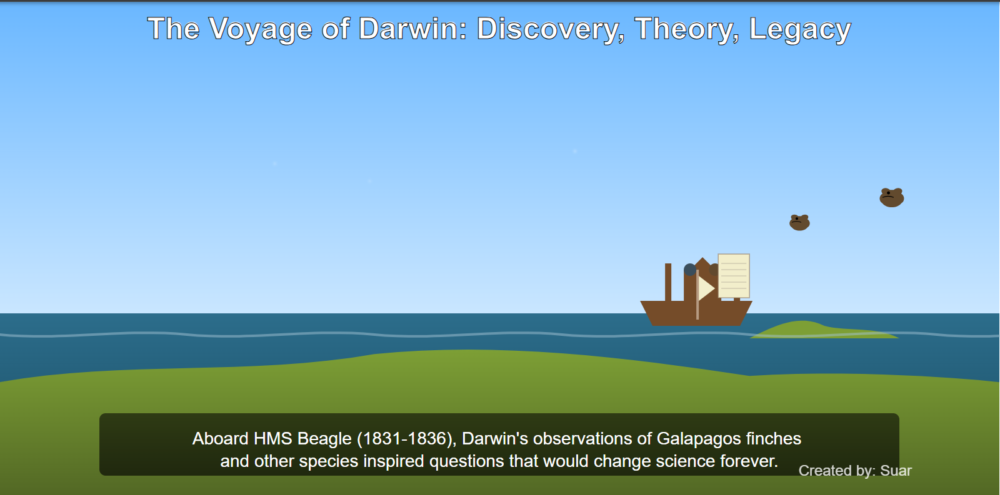

# StorySVG: AI-Powered Animated Storytelling Platform

> Transform text into professional SVG animations using AI

[](https://github.com)
[](https://github.com)
[](https://github.com)

---

## 📖 About

**StorySVG** is a web-based platform that automatically converts text descriptions into professional-quality animated SVG graphics using GPT-4.1. Created as my graduate thesis project, it democratizes animation creation by eliminating the need for coding or design expertise.

**Author:** Irfani Suar (蘇苡凡)  
**Supervisor:** Professor 王佳盈  
**Institution:** Chung Yuan Christian University

---

## ✨ Key Features

- 🎨 **Text-to-Animation**: Write a story, get an animated SVG
- 🤖 **AI-Powered**: GPT-4.1 understands context and creates coherent visuals
- 🎯 **Zero Configuration**: No technical knowledge required
- ⚡ **Fast Generation**: ~3.8 minutes average
- 📱 **Cross-Platform**: Works on all modern browsers
- 🎭 **Multiple Modes**: Single scenes or complete multi-scene narratives

---

## 🚀 How It Works

```
1. Enter Story Text → 2. AI Processing → 3. Instant Preview → 4. Download & Share
```

The platform uses intelligent prompt engineering to generate animations that include:
- Character designs and movements
- Scene settings and backgrounds
- Smooth transitions and effects
- Thematic color progressions
- Professional typography

---

## 🖼️ Screenshots

### Template Gallery
<p align="center">
 </p>

### Story Creation
<p align="center">
 </p>

### Edit & Manage
<p align="center">
 </p>

*See more in the [screenshots](./screenshots) folder*

---

## 🎬 Generated Results Screenshots

### Darwin's Voyage - Historical Narrative
<p align="center">
 </p>

**Input:** "The Voyage of Darwin"

**Output:** Three-scene animated story showing:
- HMS Beagle sailing voyage
- Darwin's observations in Galapagos
- Legacy of evolutionary theory
- Smooth animations with ocean waves and flying birds
- Professional color transitions (blue sky, ocean, green islands)

---

### Leonardo da Vinci - Early Life Scene
<p align="center">
 </p>

**Input:** "Young Leonardo da Vinci early life"

**Output:** Single-scene animation featuring:
- Character design and positioning
- Indoor setting with windows and furniture
- Atmospheric lighting and shadows
- Creative composition showing artistic beginning
- Soft, warm color palette

---

## 🏗️ Technology Stack

| Layer | Technology |
|-------|-----------|
| **Frontend** | Vue.js 3 + TypeScript |
| **Backend** | Flask (Python) |
| **AI Engine** | OpenAI GPT-4.1 |
| **Database** | MySQL 8.0 |
| **Graphics** | SVG + CSS Animations |

---

## 📊 Performance

- ✅ **100% Success Rate** across all test scenarios
- ⚡ **228.2 seconds** average generation time
- 📝 **21,000+ characters** consistent output length
- 🎯 **99.9% API efficiency** correlation

---

## 📚 Documentation

- **[Project Review](./PROJECT_REVIEW.md)** - Complete system overview and research findings
- **[Screenshots](./screenshots)** - Visual demonstration of platform features

---

## 🎓 Research Contribution

This project demonstrates:
- **Minimal-configuration design** for complex AI systems
- **AI-human creative partnership** that enhances rather than replaces
- **Democratization of professional tools** through intelligent automation
- **Production-ready architecture** for AI-assisted creative applications

---

## ⚠️ Code Repository Note

The complete source code is maintained in my professor's GitHub repository as part of our academic collaboration. This repository showcases the project through:
- System architecture and design decisions
- Research methodology and findings
- Performance testing and validation
- User interface and functionality demonstrations

---

## 📄 License

Academic research project - Chung Yuan Christian University

---

## 🙏 Acknowledgments

- **Supervisor:** Professor 王佳盈 for guidance and support
- **OpenAI:** GPT-4.1 API access
- **Open Source Community:** Vue.js and Flask frameworks

---

## 📧 Contact

**Irfani Suar (蘇苡凡)**  
- GitHub: [@isuar](https://github.com/isuar)
- Email: irfani.suar@gmail.com

---

<div align="center">
  
**Animating Digital Narratives: A Web-Integrated Approach to Automated Visual Storytelling**

*Making professional animation accessible to everyone*

</div>
